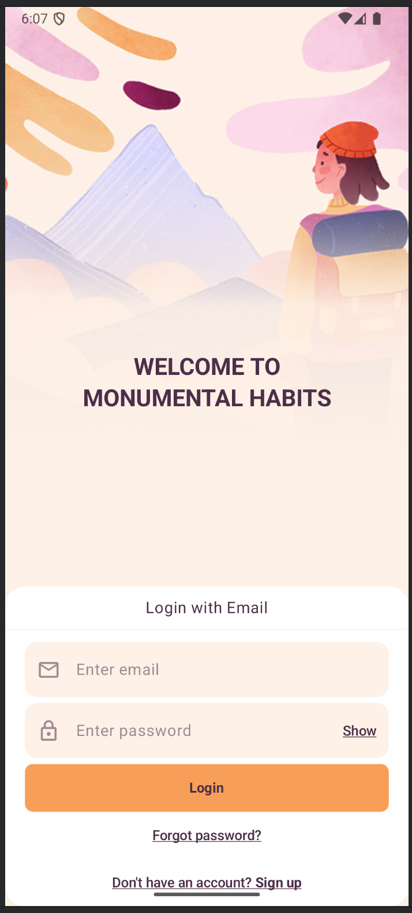
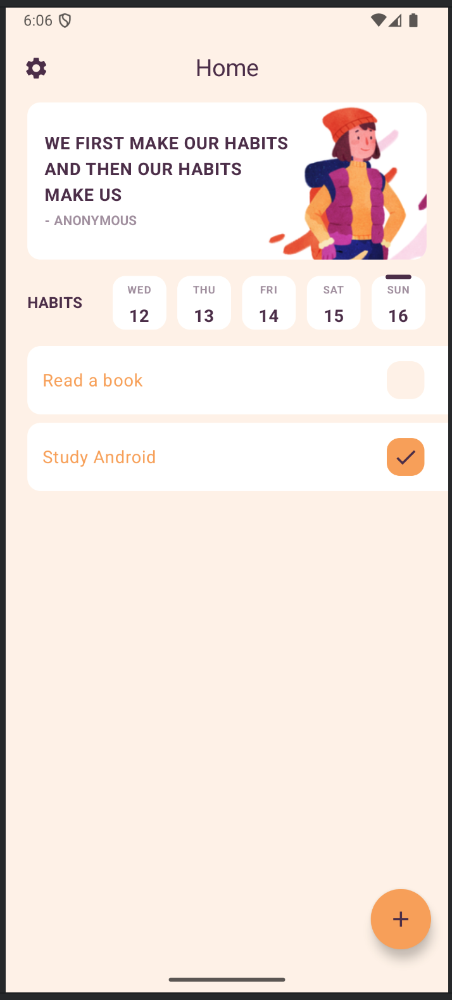
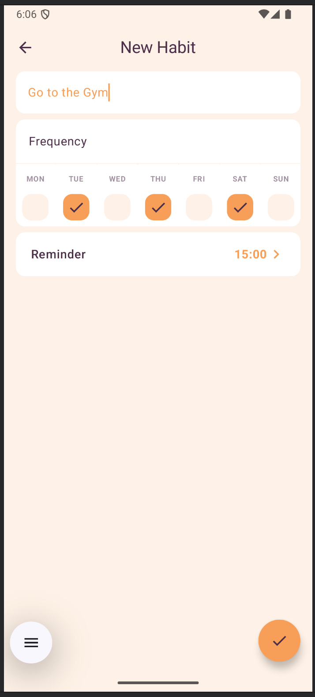

# Habits App

**Habits App** is a mobile application designed to help users build and track habits effectively. Built entirely with **Kotlin** and **Jetpack Compose**, the app showcases modern Android application development practices.

This project features a **modularized architecture** following the principles of **Clean Architecture** and the **MVI (Model-View-Intent)** pattern to ensure scalability, testability, and maintainable code.

The app supports **offline-first usage** powered by **Room** as the local database, and syncs seamlessly with a **Firebase** backend for authentication and cloud storage. Background tasks are managed with **WorkManager**, and custom reminders are scheduled using **AlarmManager**.

